# PVE


## Prepare KVM Templates

1. Login to PVE host and download cloud images   
[Ubuntu 24.04](https://cloud-images.ubuntu.com/noble/current/noble-server-cloudimg-amd64.img)   
[Ubuntu 22.04](https://cloud-images.ubuntu.com/jammy/current/jammy-server-cloudimg-amd64.img)   
[Debian 13](https://cdimage.debian.org/images/cloud/trixie/latest/debian-13-generic-amd64.qcow2)   
[Debian 12](https://cdimage.debian.org/images/cloud/bookworm/latest/debian-12-generic-amd64.qcow2)   
[AlmaLinux 10](https://repo.almalinux.org/almalinux/10/cloud/x86_64/images/AlmaLinux-10-GenericCloud-latest.x86_64.qcow2)   
[AlmaLinux 9](https://repo.almalinux.org/almalinux/9/cloud/x86_64/images/AlmaLinux-9-GenericCloud-latest.x86_64.qcow2)   

2. Create a new VM without disk and CD/DVD drive

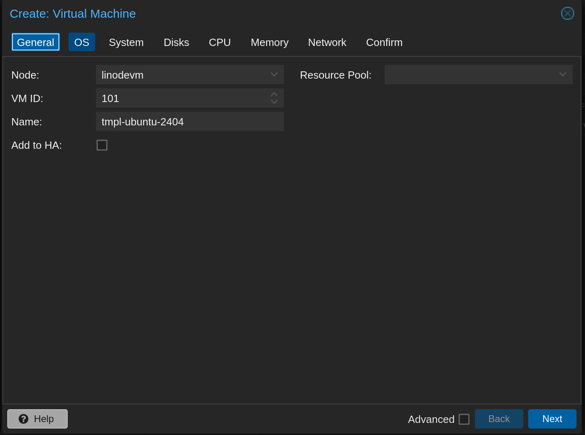
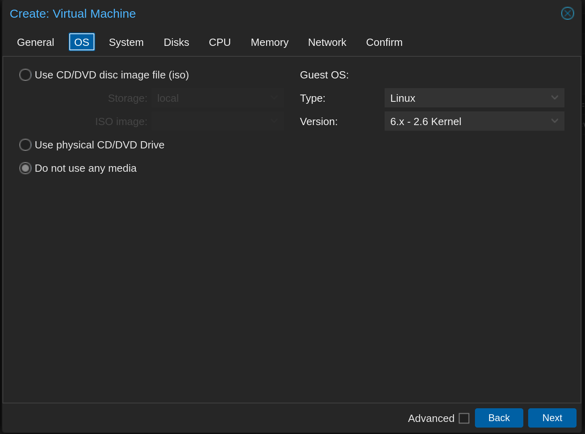
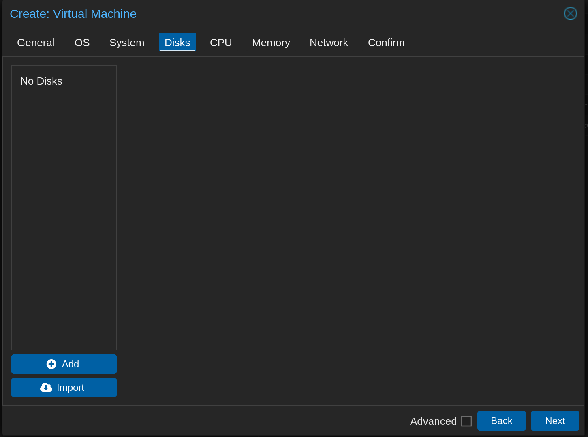
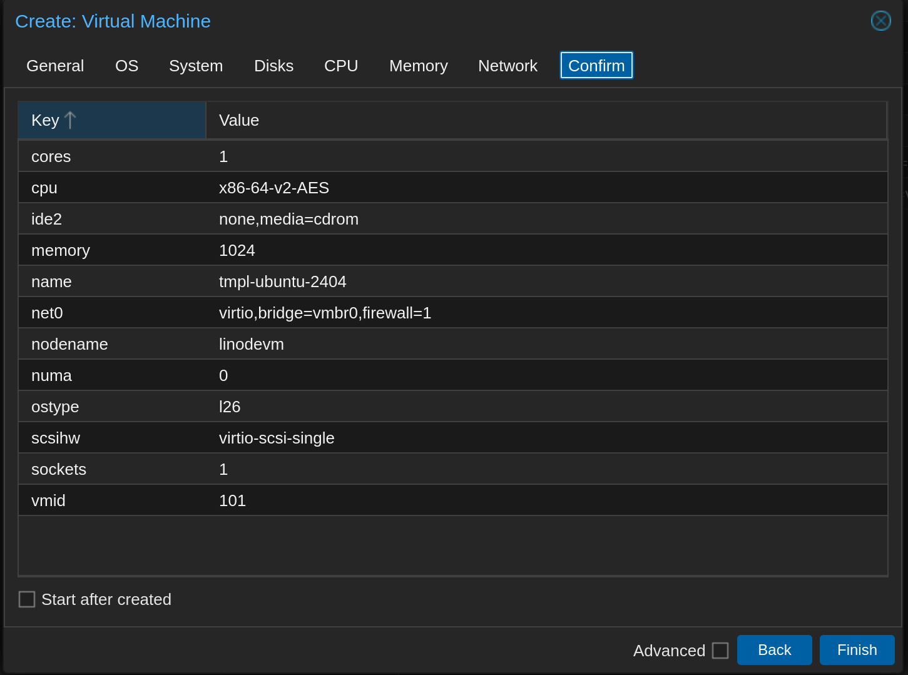

3. Import downloaded cloud image as disk. Executed on PVE host shell:

```
qm set 101 --scsi0 local:0,import-from=/root/noble-server-cloudimg-amd64.img
       ^           ^                   ^
       VMID        Storage Name        Path to downloaded image
```

4. Add cloud-init drive

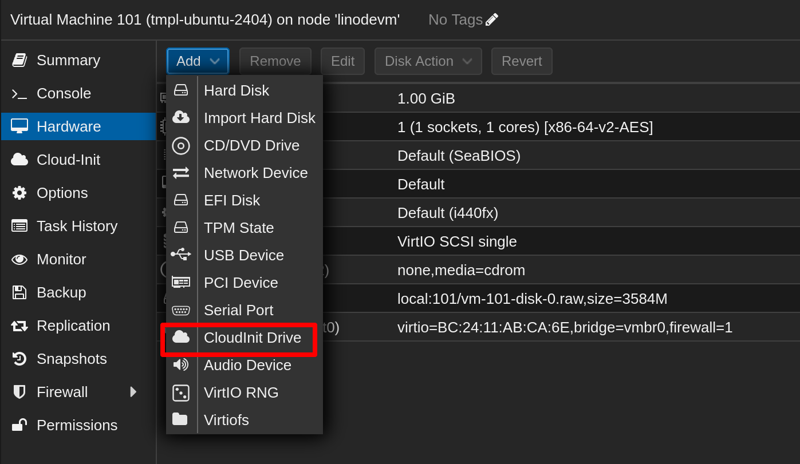

5. Convert vm to template

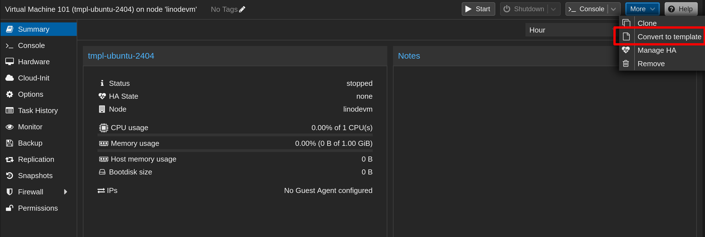


## Add PVE host to billing3

1. Go to `/admin/server` and click `Add`

2. 

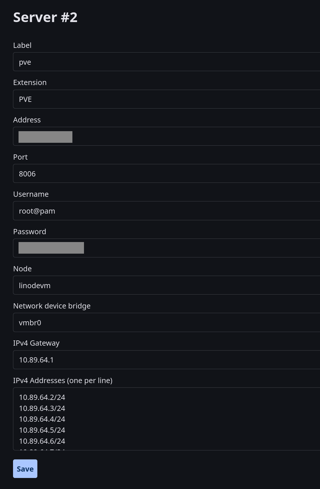

`IPv4 Gateway` is the gateway that the VMs will use to access the internet.

`IPv4 Addresses` is that list of IPs that can be assigned to VMs.

## Add a product

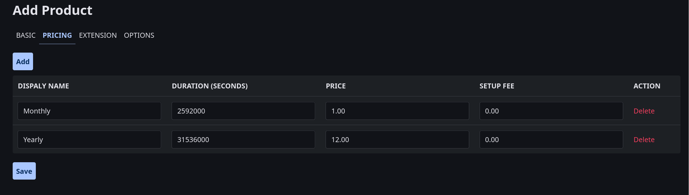

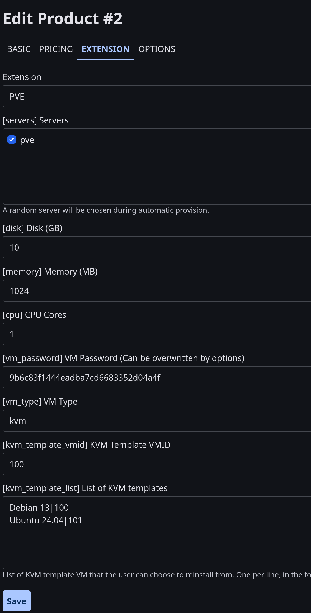

Create a option to allow users to set password when ordering.

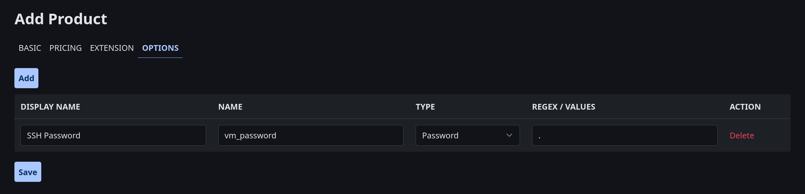

Create another option to allow users to select OS template when ordering.

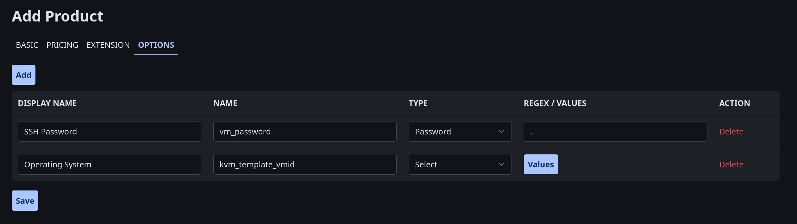

Click `Values` to set available options for this option.

In the `VALUE` field, enter the VMID of the template you created earlier, and in the `DISPLAY NAME` field, enter the name that will be displayed to users.

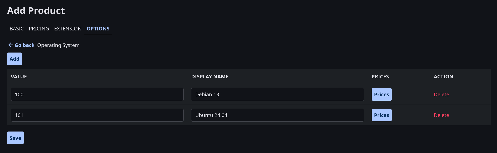

Click the `Prices` button on each value to set the price. Make sure a price exists for at least one billing cycle.

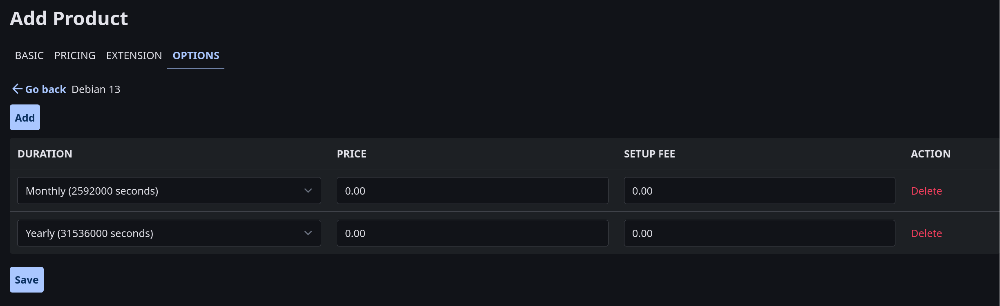